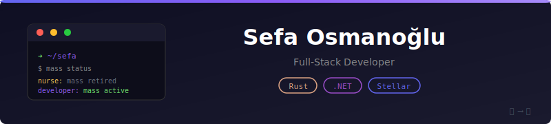

<div align="center">



<br/>

*Former nurse turned passionate developer, blending care with code*

<br/>

[](https://github.com/sefaosm)
[](https://github.com/sefaosm?tab=followers)

</div>

---

## 🧩 About Me

```typescript
const sefa = {
    location: "Turkey 🇹🇷",
    background: "Healthcare → Software Development",
    currentFocus: ["Blockchain", "Backend Systems", "Creative Coding"],
    funFact: "Still injecting discipline, now into software 💻"
};
```

- 💻 Self-taught developer with hands-on experience in **Rust**, **C# / ASP.NET Core**, **React**, and **TypeScript**
- ⚙️ Creator of functional DApps, backend services, and game-inspired tools
- 🎮 Currently building a **D&D-inspired character builder** for Baldur's Gate 3
- 🧪 Passionate about **blockchain**, **backend development**, and **creative coding**

---

## 🛠️ Tech Arsenal

<div align="center">


<br/><br/>


</div>

---

## 🚀 Featured Projects

### ⛓️ [Stake-X](https://github.com/sefaosm/Stake-X)
> 🔗 Decentralized staking platform on **MultiversX**  
> `React` `TypeScript` `Rust` `Smart Contracts` `Web Wallet Auth`

### 📝 [BlogApp](https://github.com/sefaosm/BlogApp)
> ✍️ Full-featured blog platform built with **ASP.NET Core MVC**  
> `C#` `EF Core` `MS SQL` `Bootstrap` `jQuery`

### ⚙️ Transafety *(In Development)*
> 🔐 Secure payment/trade platform on **Stellar Blockchain**  
> `Soroban SDK` `Rust` `Stellar`

---

## 📊 GitHub Stats

<div align="center">

|
 📈 Stats 
|
-----------


</div>

---

## 🤝 Let's Connect

<div align="center">

[](mailto:sfsmnl@gmail.com)
[](https://linkedin.com/in/sefaosm)
[](https://github.com/sefaosm)

---

<br/>
<br/>


</div>
